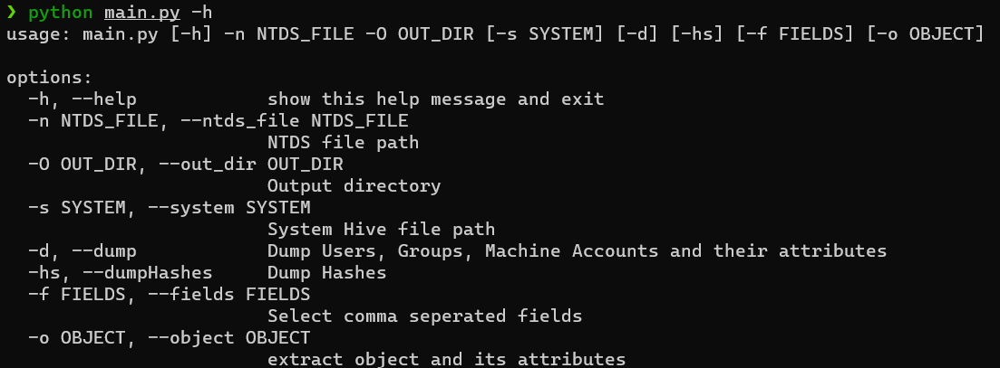

# NTDSextract

Python3 tool used to parse NTDS.dit file and extract User, groups and machine accounts and dump hashes.

```
options:
  -h, --help            show this help message and exit
  -n NTDS_FILE, --ntds_file NTDS_FILE
                        NTDS file path
  -O OUT_DIR, --out_dir OUT_DIR
                        Output directory
  -s SYSTEM, --system SYSTEM
                        System Hive file path
  -d, --dump            Dump Users, Groups, Machine Accounts and their attributes
  -hs, --dumpHashes     Dump Hashes
  -f FIELDS, --fields FIELDS
                        Select comma seperated fields
  -o OBJECT, --object OBJECT
                        extract object and its attributes
```




## Dump users 
```
python main.py -n ntds.dit -d -o user -O test
```
## Dump Groups
```
python main.py -n ntds.dit -d -o group -O test
```
## Dump all available objects (users, groups, machine accounts)
```
python main.py -n ntds.dit -d -o all -O test
```
# Dump object using specified attributes
```
python main.py -n ntds.dit  -O test -d "samaccountname,samaccounttype,pwdlastset"
```
## Dump Hashes
```
to dump hashes you need the System Hive file
python main.py -n ntds.dit -s SYSTEM -O test -hs
```


